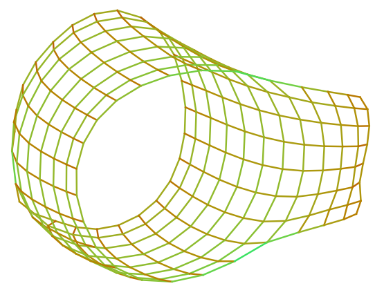
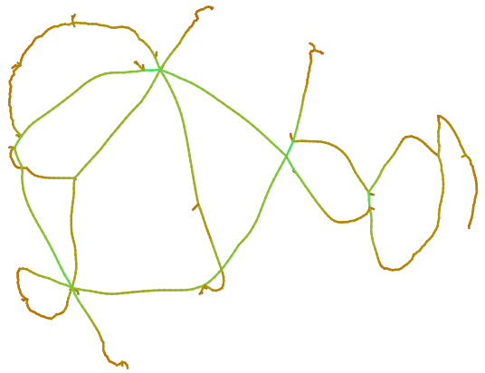

Easy and attractive visualizations of sparse matrices and graphs.

### Samples

### Documentation

Highlights are given here, but the user is encouraged to read the source code as necessary.

This is powered by an extension of [PyGraphviz's](https://pygraphviz.github.io/documentation/stable/) `AGraph` class.
Specifically, the following methods have been added:
- `from_mtx()`: read in graph from a `.mtx` file (the [SuiteSparse](https://sparse.tamu.edu/)/[MatrixMarket](https://math.nist.gov/MatrixMarket/) standard)
- `from_gv()`: read in graph (connectivity and node positions only) from a [DOT format](https://graphviz.org/doc/info/lang.html) graph that **has already been laid out** by a program like `neato` or `sfdp`; the file `foo.gv` from `neato graph.gv > foo.gv` is an example of a legal input file for `from_gv()`
- `mm_vis()`: visualize a laid out graph in the style of [Yifan Hu's Gallery of Large Graphs](https://people.engr.tamu.edu/davis/matrices.html), can create and show its own figure, or may be called as `mm_vis(fig,ax)` if you want control of the figure (for example to use `savefig()`

See `vis.py` for an example script that uses the functions above in a representative workflow.
It may be called on a `.mtx` file as `python vis.py <your file>.mtx`, but also works on laid out `.gv` files.

### Dependencies

Required:
- `matplotlib`
- `numpy`
- `pygraphviz`
- `cmasher`

All are available through `pip`.

I suggest using some sort of "SuiteSparse-getter" like [`ssgetpy`](https://github.com/drdarshan/ssgetpy) to retrieve `.mtx` files.

A few `.mtx` files are included: `will57.mtx` is small and good for prototyping, `grid1_dual.mtx` and `M10PI_n.mtx` are used to generate the figures above.

### Sources

The pipeline to create these visualization was informed by the following:
[Yifan Hu's Gallery of Large Graphs](https://people.engr.tamu.edu/davis/matrices.html),
[Tim Davis's synopsis of how Yifan Hu generated his figures](https://people.engr.tamu.edu/davis/matrices.html).

### Limitations

- Some visualization don't match the ones reported on SuiteSparse.
  A relatively tame example is [mhdb416](https://sparse.tamu.edu/Bai/mhdb416), where it seems the SuiteSparse visualization is a large connected component (which I thought the `strict` parameter of the DOT language or `sfdp` did automatically, but we see all connected components).
  Less tame examples frequently include non-square matrices like [lp_gfrd_pnc](https://sparse.tamu.edu/LPnetlib/lp_gfrd_pnc).

- Some matrices, like [shl_0](https://sparse.tamu.edu/HB/shl_0) or [west1505](https://sparse.tamu.edu/HB/west1505), have multiple visualizations.
  According to [the UF Sparse Matrix Collection page on west1505](https://www.cise.ufl.edu/research/sparse/matrices/HB/west1505.html) there are bipartite graphs and graphs corresponding to `A + A^T`.
  We only seem to be producing the one corresponding to the symmetrization.
