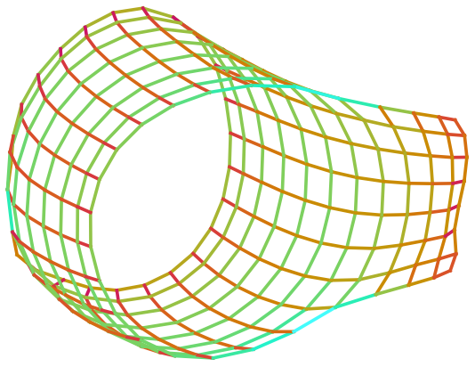
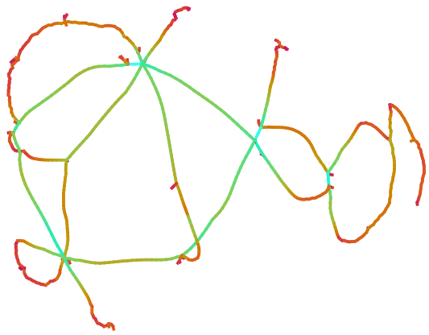

## `visla`
Easy and attractive visualizations of sparse matrices and graphs.

### Samples




### Usage
`visla` is a command line program to visualize graphs in 2D in the style of [Yifan Hu's Gallery of Large Graphs](http://yifanhu.net/GALLERY/GRAPHS/index.html)

The two figures above were generated with (respectively)
```
$ visla grid1_dual.mtx
$ visla M10PI_n.mtx
```

It reads a variety of input formats, including: Matrix Market, CSV, npz (saved by `scipy.sparse.save_npz`, dot/gv.
You can try it out on the small matrices in `matrices/`.

If you want more fine grained control (like a custom colormap) use the `visla.VGraph` class (documentation below) in a Python program.


### Installation
Once you've obtained the source code for this repository, you can install it as a local package via
```
pip install -e .
```

### Documentation
The `visla` command line program has a help message; the rest of this section is dedicated to highlighting the `visla.VGraph` class.
The user is encouraged to read the source code as necessary.

This is powered by an extension of [PyGraphviz's](https://pygraphviz.github.io/documentation/stable/) `AGraph` class.
Specifically, the following methods and fields have been added:
- `from_file()`: read in graph from a file, currently supporting:
  - `mtx`: [Matrix Market](https://math.nist.gov/MatrixMarket/formats.html)
  - `csv`: comma separated values (first line dimensions, rest of lines `i, j, A_ij`)
  - `npz`: npz files saved by [`scipy.sparse.save_npz`](https://docs.scipy.org/doc/scipy/reference/generated/scipy.sparse.save_npz.html)
  - `gv/dot`: Graphviz [dot language](https://graphviz.org/docs/outputs/canon/) files 
- `visualize()`: visualize a laid out graph; creates, shows, and destroys its own figure by default, but may be called as `mm_vis(fig,ax)` if you want control of the figure (for example to use `savefig()`)
- `bg_color`: color of background
- `cm`: color map taking `edge length -> edge color`
- `bipartite`: visualize the bipartite graph corresponding to the sparse matrix (useful for non-square matrices)

For now, see `bin/visla` to see how some of these options are used.


### Notes

I suggest using some sort of "SuiteSparse-getter" like [`ssgetpy`](https://github.com/drdarshan/ssgetpy) (available via pip) to retrieve `.mtx` files before feeding them to `visla`.

A few `.mtx` files are included: `will57.mtx` is small and good for prototyping, `grid1_dual.mtx` and `M10PI_n.mtx` are used to generate the figures above.


### Sources

The pipeline to create these visualization was informed by the following:

- [Yifan Hu's Gallery of Large Graphs](http://yifanhu.net/GALLERY/GRAPHS/index.html)
- [Tim Davis's synopsis of how Yifan Hu generated his figures](https://people.engr.tamu.edu/davis/matrices.html)


### Limitations

- The parser to get connectivity and coordinates was hacked together and made to work on practical examples.
  (See `todo.md` for some possible improvements.)
- Render performance is relatively poor compared to layout performance, on which we beat the reported CPU times (for example http://yifanhu.net/GALLERY/GRAPHS/GIF_SMALL/AG-Monien@grid1_dual.html) probably because we're using the same implementation on modern hardware).
  (See `todo.md` for some possible improvements.)

